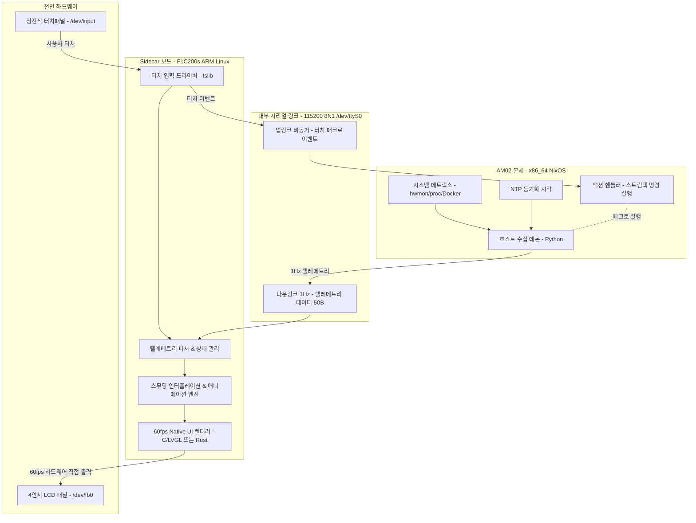

# AM02 Sidecar 로드맵 (Roadmap)

- [비전 (Vision)](#비전-vision)
- [시스템 아키텍처 (2계층 분할 설계)](#시스템-아키텍처-2계층-분할-설계)
- [기술 스택 및 역할 분담](#기술-스택-및-역할-분담)
- [마일스톤 상세 (Milestones)](#마일스톤-상세-milestones)
- [진행 현황 (Progress)](#진행-현황-progress)

---

## 비전 (Vision)

**AM02 Sidecar**는 메인 PC(오토바이 본체, x86_64 NixOS) 옆에 나란히 붙어 함께 달리는 보조 컴퓨터(사이드카, Allwinner F1C200s ARM Linux)를 완전 개방하는 프로젝트입니다.

제조사의 폐쇄적인 순정 펌웨어와 고질적인 시계 오차(flag_5081 래치 버그)를 극복하고, 전면 4인치 터치 디스플레이를 **60fps 고주사율 홈랩 대시보드** 및 **터치 스트림덱(물리 매크로 패드)**으로 자유롭게 제어하는 것을 목표로 합니다.

---

## 시스템 아키텍처 (2계층 분할 설계)

시리얼 대역폭 한계(115200 baud = 약 11.5 KB/s)로 인해 풀프레임 영상 스트리밍(460 KB/프레임)은 불가능합니다.  
따라서 **데이터 수집(1Hz)**과 **그래픽 렌더링(60fps)**을 철저히 분리하는 2계층 구조를 채택합니다.



---

## 기술 스택 및 역할 분담

| 계층 | 실행 환경 | 주력 언어/도구 | 갱신 주기 | 핵심 역할 |
| :--- | :--- | :--- | :--- | :--- |
| **Host Tier** | AM02 본체 (x86_64 NixOS) | Python 3 | 1 Hz (1초 1회) | CPU/GPU 온도, RAM, 스토리지, Docker 상태, 네트워크 트래픽, NTP 시각 수집 및 경량 패킷 송신 |
| **Link Tier** | 메인보드 내장 UART (`/dev/ttyS0`) | PPP / SLIP / Raw UART | - | 115200 baud 양방향 통신 (호스트 메트릭 전송 + 서브스크린 터치 이벤트 수신) |
| **Sidecar Tier** | F1C200s (ARM9 533MHz, 64MB RAM) | C (LVGL) 또는 Rust | 60 fps (실시간) | 프레임버퍼(`/dev/fb0`) 60fps 애니메이션 렌더링, 게이지 스무딩, 터치스크린 이벤트 감지 |

---

## 마일스톤 상세 (Milestones)

### Phase 0: 순정 프로토콜 호환 데몬 (완료, v0.1.0)
- [x] `/dev/ttyS0` 115200 8N1 UART 통신 링크 확립
- [x] AYASpace v2 프로토콜 리버스 엔지니어링 (253B 바이너리 프레임, CRC32 LE 앞단 패킹)
- [x] CPU/GPU 온도 hwmon 수집 및 실시간 전송 데몬 구현
- [x] NixOS 모듈화 (`services.am02-subscreen`) 및 부팅 시 NTP 대기 preStart 추가

---

### Phase 1: Sidecar 진입 및 쉘 개방 (Root Shell & Backup)
- [ ] **MicroSD 풀 덤프 백업**:
  - AM02 하판 분해 후 서브스크린 보드의 MicroSD 카드 추출
  - 호스트에서 전체 디스크 이미지 백업:
    ```bash
    dd if=/dev/sdX of=am02-sidecar-stock.img bs=4M status=progress
    ```
  - 작업 중 문제 발생 시 100% 공장 출하 상태로 원복 보장
- [ ] **파일시스템 파티션 분석**:
  - 부트 파티션(FAT) 및 루트 파일시스템(ext4) 구조 확인
  - `/etc/init.d/` 부팅 시퀀스 및 `/data/app/` 순정 앱 분석
- [ ] **시리얼 루트 콘솔 개방**:
  - `/etc/init.d/S99runOnUi`의 포트 독점 해제
  - `/etc/inittab`의 `/dev/ttyS0` 시리얼 로그인 쉘(`getty`) 활성화
- [ ] **검증**: 본체 NixOS에서 `picocom -b 115200 /dev/ttyS0`로 root 로그인 검증

---

### Phase 2: 시리얼 기반 IP 네트워크 & SSH 구축
- [ ] **가상 네트워크 링크 구성**:
  - 시리얼 선 위에 PPP(Point-to-Point Protocol) 또는 SLIP 구성
  - 사설 IP 할당: 본체(`192.168.100.1`) <-> Sidecar(`192.168.100.2`)
- [ ] **Dropbear SSH 서버 구동**:
  - 서브스크린 부팅 시 Dropbear 데몬 자동 시작 등록
  - SSH 공개키(`authorized_keys`) 주입으로 무암호 원격 접속 확립
- [ ] **개발 파이프라인 확립**:
  - 본체에서 하판 분해 없이 `ssh root@192.168.100.2`로 원격 관리
  - `scp`를 통한 바이너리/에셋 원격 배포 환경 완성

---

### Phase 3: 무재부팅 실시간 시각 동기화 (Time Sync)
- [ ] **펌웨어 시간 래치 버그(`flag_5081`) 영구 해결**:
  - 방안 A: 순정 `minipc-screen-launcher` 바이너리의 `flag_5081` 체크 분기 NOP 패치
  - 방안 B: SSH/시리얼 기반 주기적 `date -s` 호스트 NTP 동기화 에이전트 구동
- [ ] **검증**: 본체를 수개월간 24시간 가동해도 서브스크린 시각이 1초도 틀어지지 않음을 검증

---

### Phase 4: Sidecar 60fps Native UI & 시스템 모니터링 대시보드
- [ ] **크로스 컴파일 환경 구축**:
  - ARMv5TE(`arm-unknown-linux-musleabi`) 빌드 환경 (Nix derivation 또는 툴체인)
- [ ] **초경량 프레임버퍼 드라이버**:
  - `/dev/fb0` 더블 버퍼링 기반 60fps 드라이버 초기화
- [ ] **운영 시스템 & 인프라 모니터링 수집기 (Host)**:
  - **호스트 리소스**: CPU/GPU 클록·온도·로드율, RAM/Swap, NVMe 잔여량
  - **핵심 systemd 서비스**: `hermes-agent`, `tailscaled`, `beszel-agent` 등 가동 여부(`active`/`failed`) 헬스체크
  - **컨테이너 현황**: Docker/Podman 실행 중인 컨테이너 수 및 상태
  - **홈랩 인프라 연동**: Beszel 허브 API 및 Tailscale 네트워크 노드 상태 수집
  - **실시간 트래픽**: 네트워크 인터페이스 실시간 RX/TX 전송량(Mbps)
- [ ] **LVGL 기반 대시보드 화면 구성 (Sidecar)**:
  - **화면 1 (시계 & 메트릭)**: 레트로 플립/사이버펑크 시계 + CPU/GPU 게이지 (부드러운 스무딩 애니메이션)
  - **화면 2 (홈랩 SOC 대시보드)**: 
    - 주요 서비스 헬스체크 신호등 (정상: 초록 LED / 장애: 빨강 점멸)
    - 실시간 네트워크 트래픽 스파크라인(파형 그래프)
    - 컨테이너 및 홈랩 노드 상태 카드
  - **장애 알림**: 모니터링 중인 서비스 다운 시 전면 화면에 시각적 경고 팝업
- [ ] **1Hz 텔레메트리 파서**:
  - 본체가 1초마다 보내는 JSON/바이너리 메트릭을 수신하여 60fps로 부드럽게 UI 보간 갱신

---

### Phase 5: 터치 스트림덱 & 장애 대응 매크로 패드
- [ ] **터치 입력 파이프라인**:
  - `/dev/input/event0` 및 `tslib` 연동으로 터치 좌표 및 제스처(탭, 스와이프) 감지
  - 화면 스와이프로 시계 모드 ↔ 시스템 모니터링 대시보드 전환
- [ ] **업링크 프로토콜 구현**:
  - 화면 터치 시 시리얼/SSH 링크로 본체에 이벤트 패킷 전송 (예: `BUTTON:SERVICE_RESTART:hermes`)
- [ ] **본체 액션 매퍼 개발**:
  - **장애 원터치 복구**: 화면의 빨간 불(다운된 서비스)을 터치하면 즉시 `systemctl restart` 트리거
  - **스트림덱 매크로**: 볼륨 조절/음소거, Docker 컨테이너 재시작, 백업 실행, 스마트홈 제어

---

## 진행 현황 (Progress)

| 마일스톤 | 상태 | 비고 |
| :--- | :--- | :--- |
| Phase 0: 순정 프로토콜 데몬 | 완료 | v0.1.0 릴리즈, NixOS 서비스 가동 중 |
| Phase 1: Sidecar 진입 및 쉘 개방 | **준비 중 (최우선)** | SD 카드 백업 및 시리얼 쉘 개방 대기 |
| Phase 2: IP over Serial & SSH | 계획됨 | PPP/Dropbear 파이프라인 구성 |
| Phase 3: 시간 래치 버그 영구 해결 | 계획됨 | flag_5081 무력화 |
| Phase 4: 60fps Native UI 렌더러 | 계획됨 | C(LVGL) / Rust 프레임버퍼 렌더러 |
| Phase 5: 터치 스트림덱 연동 | 계획됨 | tslib 터치 매크로 패드 |
