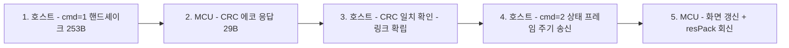

# AM-02 Subscreen 직렬 프로토콜 (v2, 확정)

> **Source (3-way 교차 검증)**:
> 1. AYASPACE 3.1.0.0 `AYASpaceCef.exe` 내 `CMiniPCLauncher` (MSVC x64) Ghidra 역컴파일 — 산출물 `/tmp/ayaspace/decomp/`
> 2. 실기 검증 (`scripts/probe.sh`, 2026-08-25) — CRC 응답·RAM/Disk %·날짜/요일/시각 렌더
> 3. 커뮤니티 MCU측 역컴파일 — [r/ayaneo 스레드](https://www.reddit.com/r/ayaneo/comments/1isly3s/) (vsoftster): `minipc-screen-launcher` GUI + `launcher-comm` 호스트 통신, shareData 구조


## 목차

- [물리 계층](#물리-계층)
- [프레임 구조](#프레임-구조)
- [메시지 시퀀스](#메시지-시퀀스)
- [시간 동기화 (MCU RTC 래치)](#시간-동기화-mcu-rtc-래치)
- [payload 필드 매핑 (cmd=2)](#payload-필드-매핑-cmd2)
- [미확인 사항](#미확인-사항)

## 물리 계층

| 항목 | 값 |
| :--- | :--- |
| 포트 | 보드 내장 UART (Windows: `\\.\COMn` / Linux: `/dev/ttyS0`) |
| baud | **115200** (`0x1c200`) |
| 데이터비트 | 8 |
| 흐름제어 | 없음 (raw)

## 프레임 구조

```text
Host → MCU (요청): 253 bytes
┌──────────────┬─────────────────────────────┐
│ CRC32 (4B)   │ payload (249 bytes)         │
│ zlib LE      │ cmd @ offset 0              │
└──────────────┴─────────────────────────────┘
  CRC 다항식: 0xEDB88320 (표준 zlib CRC32)
  바이트 오더: little-endian
  CRC는 프레임 앞에 prepend — payload 뒤가 아님 (실기 검증 2026-08-25)

MCU → Host (응답 resPack): 29 bytes
┌────────────┬──────────────────────────────┐
│ CRC32 (4B) │ 상태 (25 bytes)              │
│ 송신 CRC 에코│ cmd 에코 @ +4, 나머지 상태   │
└────────────┴──────────────────────────────┘
```

- 호스트는 payload 249바이트의 CRC32를 계산해 **앞에** 붙여 253바이트(`0xfd`) WriteFile
- MCU 응답 **첫 4바이트 = 수신 프레임의 CRC32 에코** — 불일치 시 재송신 (재시도 5회)
- **실기 검증 완료 (2026-08-25)**: cmd=1 핸드셰이크 → 29B 응답, `rx[0:4]` = 송신 CRC와 일치, `rx[4]` = 0x01 (cmd 에코 추정), 잔여 24B = 0
- CRC 위치 오류(append) 시 MCU 무응답 — 프레임 전체가 버려짐 (Phase 0 관측 "253B 무응답"의 원인)

## 메시지 시퀀스



- **cmd=1**: 핸드셰이크 — payload 전부 0 (cmd만 1). Windows는 5회 재시도하며 응답 CRC 에코 검증. 본 데몬 v0.1.0은 미사용 (cmd=2만으로 렌더링 관측)
- **cmd=2**: 상태 갱신 (평시 주기)
- **cmd=0x0d(13)**: 특수 갱신 (플래그 1회성, 이후 cmd=2로 복귀) — 실기 무응답, 조건 미확인
- Windows 구현 주기: 이벤트 시 500ms / 평시 2000ms 폴링. 본 데몬은 1000ms (스펙 60±1회/60s)

## 시간 동기화 (MCU RTC 래치)

커뮤니티 MCU측 코드 확정:

```c
if ( !flag_5081 && shareData.m_time.year ) {   // year≠0인 첫 프레임 1회
  gTimeDayAreaInfo.{year,day,hour,week,minute,month,second} = shareData.m_time.*;
  UpdateSysTime();
  flag_5081 = 1;                                // 이후 프레임의 시간 필드는 영구 무시
}
GetSysTime();  // 이후 MCU 자체 RTC로 진행
```

- **year≠0 첫 프레임만 동기화되고 이후 무시** — 실험 중 시각이 7시대에 고정된 채 안 바뀐 것은 정상 동작
- 데몬은 매 프레임 현재 시각을 payload에 실는다 — 시작 첫 프레임이 곧 동기화 프레임이 되므로 별도 게이트 불필요
- `@118 (m_time.falg.style)`≠0 전송 시 시계 요소가 화면에서 사라지는 것을 관측 (2026-08-25) — **0 고정 권장**
- dow는 0=Sunday (실기 "Tuesday" 렌더 정합, 파이썬 `tm_wday`는 0=Monday — 변환 필요)

## payload 필드 매핑 (cmd=2)

`CMiniPCLauncher::UpdateInfo` 스택 레이아웃 역산. 오프셋=구조체 시작에서의 바이트 수.

| Offset | 크기 | 타입 | 필드 (추정) | 비고 |
| :--- | :--- | :--- | :--- | :--- |
| 0 | 1 | u8 | cmd | 1/2/0x0d |
| 29 | 4 | i32 | cpu freq (MHz) | m_cpu.freq — 커뮤니티 코드 |
| 33 | 4 | f32 | cpu usage (%) | m_cpu.usage (COERCE_FLOAT) |
| 37 | 4 | f32 | cpu package (W) | m_cpu.package |
| 41 | 4 | i32 | cpu temp (°C) | m_cpu.temperature — **v0.1.0 사용**, 음수 2의 보수 |
| 45 | 4 | i32 | gpu freq (MHz) | m_gpu.freq |
| 49 | 4 | f32 | gpu usage (%) | m_gpu.usage |
| 53 | 4 | f32 | gpu package (W) | m_gpu.package |
| 57 | 4 | i32 | gpu temp (°C) | m_gpu.temperature — **v0.1.0 사용** |
| 61 | 4 | i32 | ram used (MB) | 실기 % 정합 (2026-08-25) |
| 65 | 4 | i32 | ram total (MB) | 〃 |
| 69 | 4 | i32 | ssd used | 실기 % 정합 |
| 73 | 4 | i32 | ssd total | 〃 |
| 81 | 4 | i32 | fan speed | |
| 85 | 4 | f32 | tdp cur (W) | COERCE_FLOAT — float 확정 |
| 89 | 4 | i32 | tdp type | gSetUpInfo.PowerMode |
| 93 | 4 | i32 | network download | |
| 97 | 4 | i32 | network upload | |
| 101 | 4 | i32 | network state | gFpsThunderData.netWork |
| 105 | 4 | f32? | fps | COERCE_FLOAT — 오프셋 추정 |
| 109 | 4 | i32? | brightness (m_media) | 오프셋 추정 |
| 113 | 4 | i32 | volume (m_media) | 역컴파일 getter 정합 (offset 0x71) |
| 117 | 1 | u8 | is24Hour | 1 고정 |
| 118 | 1 | u8 | style | **0 고정 권장** — ≠0 시 시계 소실 관측 |
| 119 | 2 | u16 | year | ≠0 조건이 RTC 래치 트리거 |
| 121 | 1 | u8 | month | |
| 122 | 1 | u8 | day | |
| 123 | 1 | u8 | dayOfWeek | 0=Sunday |
| 124 | 1 | u8 | hour | |
| 125 | 1 | u8 | minute | |
| 126 | 1 | u8 | second | |
| 127–128 | 2 | u8 | 미확정 | m_language/m_style 후보 — 0 권장 |
| 129 | 16 | char | weather province | |
| 145 | 16 | char | weather city | |
| 161 | 32 | char | weather 설명 | |
| 193 | 12 | char | weather temperature | |
| 205 | 12 | char | weather winddirection | |
| 217 | 32 | char | weather windpower | 217+32=249 — 페이로드 정확히 수렴 |

- 문자열 6개는 m_weather (province/city/weather/temperature/winddirection/windpower) — 커뮤니티 strcpy 시퀀스와 정합
- cpu/gpu 블록 `{freq i, usage f, package f, temp i}` — 커뮤니티 COERCE_FLOAT 패턴 확정 (본 역컴파일 {f,f,i,i} 판독은 오류)
- RAM/Disk 화면 표시는 MCU가 `used/total×100` 연산 — 호스트가 MB 단위로 실으면 됨

## 미확인 사항

1. resPack 상태 25바이트의 필드 (cmd=1/2/3 분기: brightness/volume 관련 추정) — v0.1.0 미사용
2. @127/128의 의미 (m_language/m_style 후보) — 0 송신으로 회피
3. fps/brightness 정확한 오프셋 (@105/@109 추정) — v0.1.0 미사용
4. cmd=0x0d 무응답 조건 — v0.1.0 미사용
5. 렌더 시작 후 rx가 29B→1B/프레임으로 축소되는 동작 — 응답 파싱 불가의 원인 (링크는 정상)
